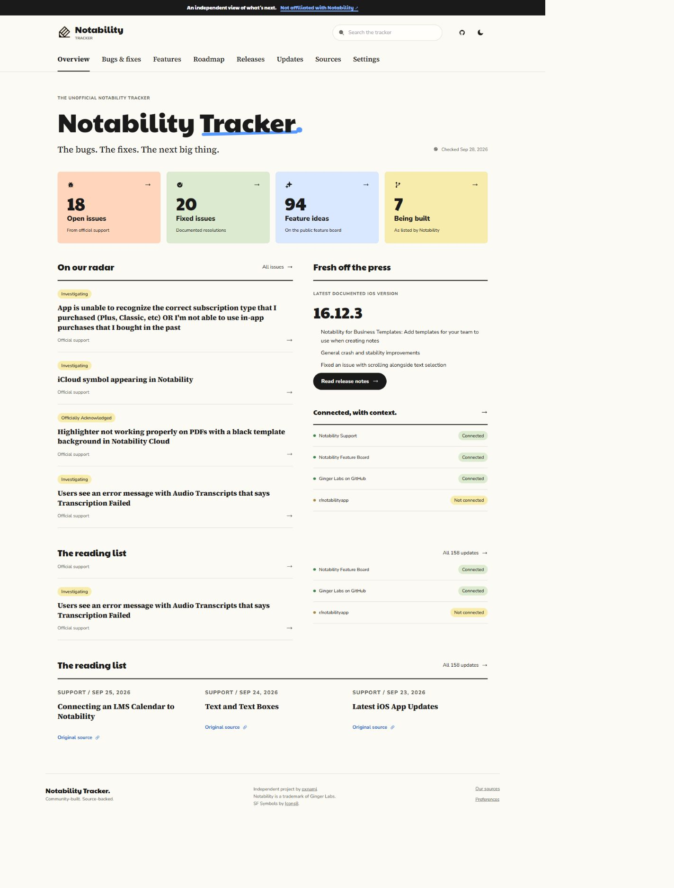
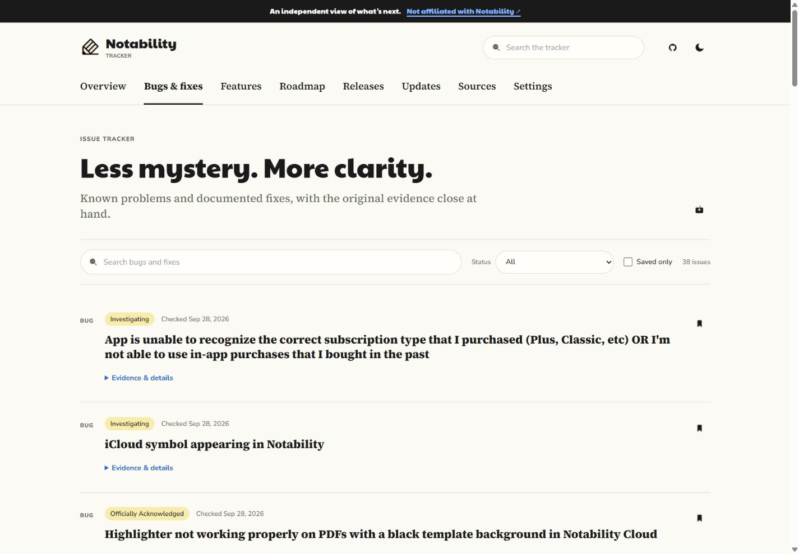
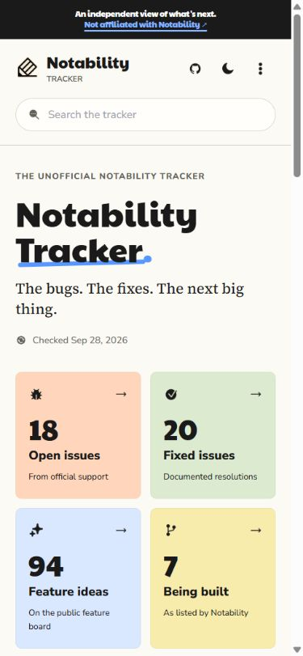
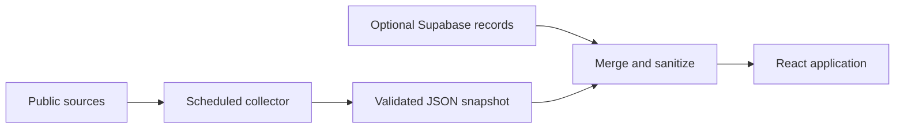

<div align="center">
  

  # Notability Tracker

  **A source-backed view of public Notability issues, fixes, feature requests, roadmap stages, and releases.**

  [](https://pxnami.github.io/Notability-Tracker/)
  [](https://pxnami.github.io/Notability-Tracker/#/sources)
  [](https://github.com/pxnami/Notability-Tracker/issues)

  <sub>Independent community project. Not affiliated with Notability or Ginger Labs.</sub>
</div>

<br>



## What it does

Notability Tracker collects public information that would otherwise be spread across support pages, release notes, the public feature board, and GitHub. It keeps the original source close to every item instead of presenting speculation as product news.

| Track | Browse | Verify |
| --- | --- | --- |
| Known issues and documented fixes | Feature requests by published roadmap stage | Original links and collection health |
| iOS release notes | Recent public development updates | Observed status history |
| Locally saved records | Searchable and filterable lists | Snapshot fallback during source outages |

## Interface

<table>
  <tr>
    <td width="72%"></td>
    <td width="28%"></td>
  </tr>
  <tr>
    <td align="center"><sub>Search, filter, save, and inspect source evidence.</sub></td>
    <td align="center"><sub>Responsive navigation and dashboard.</sub></td>
  </tr>
</table>

## Data flow



1. `scripts/collect.mjs` fetches public sources and parses them with `scripts/parsers.mjs`.
2. The collector writes the validated snapshot to `public/data/public-feed.json`.
3. `src/data/live.tsx` loads the snapshot, optionally merges public Supabase records, and exposes a normalized data model to the interface.
4. GitHub Actions tests, refreshes, builds, and deploys the site every six hours.

The committed snapshot keeps the tracker readable when an upstream service is temporarily unavailable. Snapshot records take precedence when duplicate records are found.

## Sources

| Source | Data | Collection method |
| --- | --- | --- |
| [Notability Support](https://support.gingerlabs.com/) | Public English support articles | Paginated Zendesk API |
| [Recently Reported Issues](https://support.gingerlabs.com/hc/en-us/articles/360035063091) | Ongoing and fixed issues | Structured article parsing |
| [Latest iOS App Updates](https://support.gingerlabs.com/hc/en-us/articles/9414165465882) | Versions, changes, and explicit fixes | Structured article parsing |
| [Notability Feature Board](https://portal.productboard.com/gingerlabs/1-notability/tabs/14-actively-considering) | Public cards, stages, and updates | Embedded public board data |
| [Ginger Labs on GitHub](https://github.com/Ginger-Labs) | Repositories with explicit Notability relevance | GitHub public API |

Collection time, upstream modification time, and release date remain separate values. A status-history record means the tracker observed a change between snapshots; it does not establish the exact time that the source changed.

## Built with

| Layer | Technology |
| --- | --- |
| Interface | React 18, TypeScript, React Router |
| Data | TanStack Query, Supabase, committed JSON snapshot |
| Collection | Node.js, Cheerio, Marked |
| Tooling | Vite, ESLint, Vitest, Testing Library |
| Delivery | GitHub Actions, GitHub Pages |

## Run locally

Node.js 22 or newer is required.

```sh
git clone https://github.com/pxnami/Notability-Tracker.git
cd Notability-Tracker
npm ci
npm run dev
```

No credentials are required because the repository includes the latest public snapshot. To include public database records, copy `config/.env.example` to `.env.local` and provide:

```dotenv
VITE_SUPABASE_URL=https://your-project.supabase.co
VITE_SUPABASE_ANON_KEY=your-public-key
```

Never expose a Supabase service-role or secret key to the frontend.

### Commands

```sh
npm run collect     # Refresh public source data
npm run lint        # Check code quality
npm run typecheck   # Check TypeScript
npm test            # Run the test suite
npm run build       # Create a production build
npm run preview     # Preview the production build
```

## Project structure

```text
public/data/            Generated public snapshot
config/                 Build, lint, TypeScript, and environment templates
scripts/                Collection, parsers, and parser tests
src/components/         Shared interface components
src/data/               Loading, validation, and merge boundary
src/lib/                Supabase and local preference utilities
src/pages/              Route-level views
supabase/functions/     Optional support importer
supabase/migrations/    Database schema and access policies
```

## Deployment

`.github/workflows/deploy.yml` runs on pushes to `main`, manual dispatches, and a six-hour schedule. It validates the project, refreshes the public data, builds the Vite application, and deploys it to GitHub Pages. A snapshot commit is created only when source content or status changes.

The optional `.github/workflows/sync.yml` workflow calls the Supabase importer. It requires `SUPABASE_SYNC_URL` as a repository variable and `SUPABASE_SYNC_TOKEN` as a repository secret.

## Limitations

- Only publicly available information is collected; the tracker has no access to private Notability development activity.
- Productboard stages are reproduced as published and are not delivery commitments.
- Release dates remain unspecified when the source does not publish one.
- Reddit data is unavailable until authorized API access is configured.
- Saved records live in the browser and do not synchronize between devices.

## Contributing

Bug reports and focused improvements are welcome. Read [CONTRIBUTING.md](.github/CONTRIBUTING.md) before changing collectors or source-handling behavior; source wording, attribution, and data integrity must be preserved.

## License and attribution

No software license is currently provided. The repository is publicly readable, but no permission to copy, modify, or redistribute its contents is granted by default.

Notability is a trademark of Ginger Labs. Its name and icon are used only to identify the product being tracked. Interface symbols are from the [Icons8 Apple SF Symbols](https://icons8.com/icons/family-sf-symbols) family. Paytone One, Nunito Sans, and Source Serif 4 are distributed through Fontsource under their included upstream licenses.
